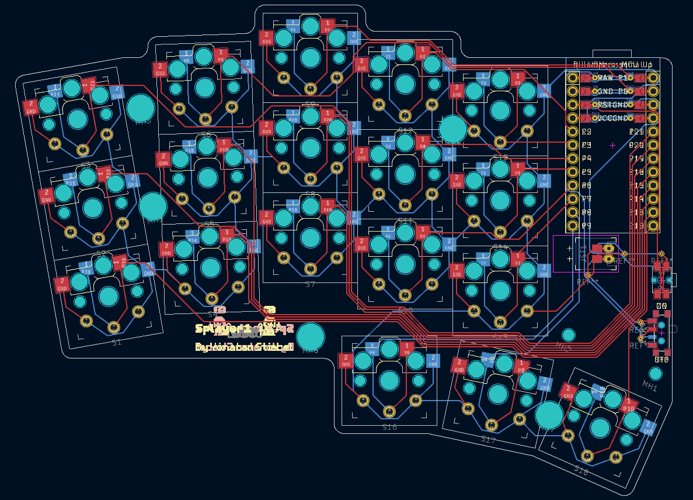

# Splayer1

 

**Splayer1** is a split, wireless, ortholinear, column-staggered, splayed keyboard.

 

Each half of the keyboard has 3 rows, 5 columns and 3 extra thumb keys. 

The pinky and ring finger columns are slightly staggered and splayed (hence the name), making for a non-aggressive layout.

The board is choc-spaced, compatible with both v1 Kailh Choc switches. 

The keyboard is diodeless and hotswappable, so it can be assembled with minimal solder work. 

The PCB is flippable, and can be used for both halves of the keyboard.
